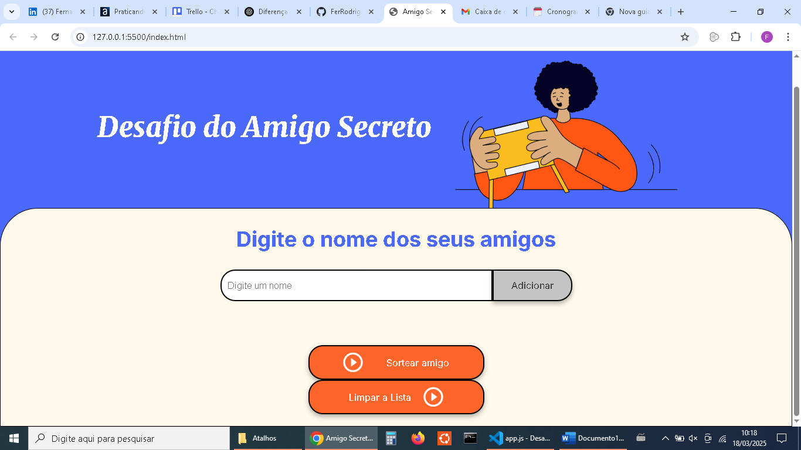
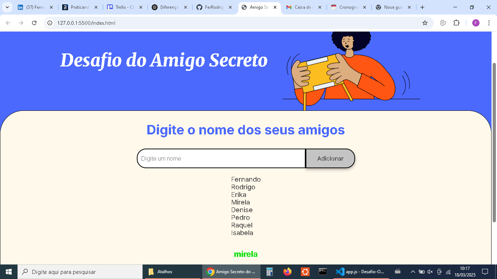

# Desafio do Projeto de Programação do Treinamento Oracle/ONE
Este projeto é parte de um desafio para programação de iniciantes. Feito para os estudantes aplicarem os conhecimentos da linguagem JavaScript
## Qual é a proposta?
Aprender a programação na forma de uma desafio. Foi disponibilizado o CSS e HTML, mas fiz algumas adaptações.   
## Tecnologias Usadas
- JavaScript
- HTML
- CSS
# Uso
- Você insere dois ou mais nomes de amigos. Vai aparecer a lista deles na tela. Ao clicar com o botão sortear amigo, o sistena irá retornar um nome desta lista de amigos.
- Depois pode limpar e começar novamente. Não é permitido menos do que dois nomes e nomes vazios.
## Imagem

## Minha experiência
Estou no inicio da lógica de programação e tive bastante dificuldade em colocar em pratica o projeto, foi desafiador. Não estava nem um pouco familiarizado com a linguagem técnica da área e nem com a linguagem especifica (HTML, CSS e JavaScript) Foi divertido aprender, se não fosse os foruns e os recursos da internet. Eu levaria muito mais tempo para fazer sozinho. Pegava alguns exemplos e procurava entender a lógica de programar. Posso dizer que avancei, mas falta muita coisa ainda...   

